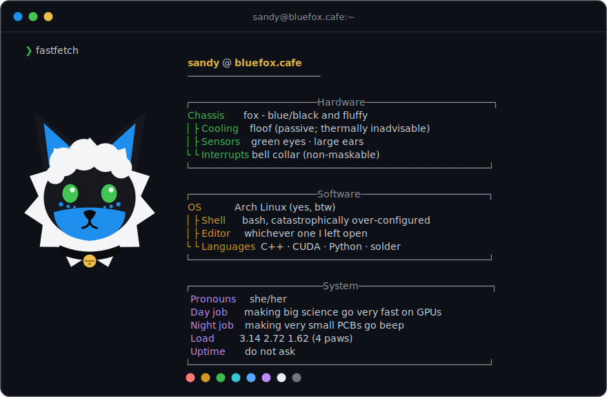

<!-- banner: lofi fox soldering, when the commission lands -->
<!-- <picture>
  <source media="(prefers-color-scheme: dark)" srcset="assets/banner-dark.png">
  
</picture> -->

### `whoami`

Blue fox, scientist and developer, living at the seam where hardware meets software - and occasionally where both meet a sewing machine.

Most days are CUDA kernels and profiler flame graphs, and the eternal hunt for the next 5%. Then the soldering iron comes out - reflow paste, 0402s I immediately regret, and firmware that works on the third flash. Both ends run on an Arch install I'm emotionally attached to and a bash config well past the point of medical advice.

### What I build

| | |
|---|---|
| 🦴 [**smol-biscuits**](https://github.com/biscuitvixen/smol-biscuits) | Tiny SlimeVR-compatible full-body trackers - custom PCB, firmware, and printed cases for the XIAO nRF52840 |
| 🤖 [**protOS**](https://github.com/biscuitvixen/protOS) | Dynamic environment for a protogen visor - the animated LED face that rides on the suit |
| ☕ [**fox_cafe**](https://github.com/biscuitvixen/fox_cafe) | Self-hosted Foundry VTT stack, Discord-OAuth-gated behind Caddy |
| 🖥️ [**homelab**](https://github.com/biscuitvixen/homelab) | Docker Compose for the little home server that quietly hosts the rest |

It's mostly wearables, home automation, and electronics that end up sewn into fursuits - plus whatever the home server has decided to run this week.

### Find me

[Telegram](https://t.me/biscuit_fox) · [Discord](https://discordapp.com/users/biscuit_fox) · [The Blue Fox Herself](https://bluefox.cafe/)
