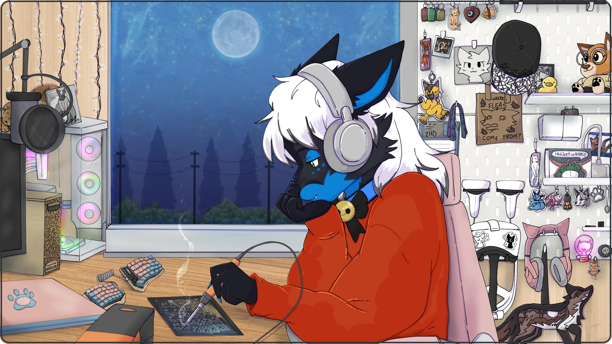
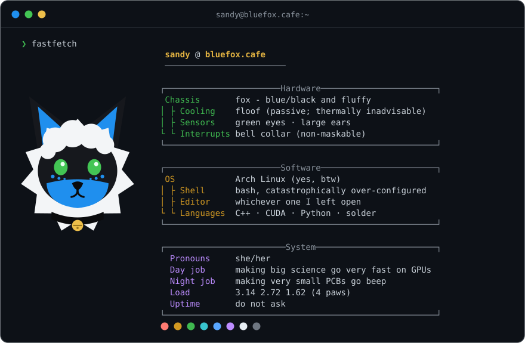

<!-- banner: lofi fox soldering, when the commission lands -->
<picture>
  <source media="(prefers-color-scheme: dark)" srcset="assets/banner.webp">
  
</picture>

<em>lofi beats to solder to</em> · Art by <a href="https://www.beffumsartworks.com/">beffums</a>

&nbsp;

### `whoami`

Scientist and developer. I spend my days making GPUs go fast - CUDA kernels, profiler traces, arguing with nsight about occupancy - and my evenings on the hardware side. Custom PCBs, tiny 0402s I immediately regret, firmware for things that end up sewn into a fursuit. Honestly the best part is when the two halves meet.

All of it runs on an Arch install I'm emotionally attached to.

### What I build

| | |
|---|---|
| <abbr title="mu - micro, the tiny trackers">μ</abbr> [**smol-biscuits**](https://github.com/biscuitvixen/smol-biscuits) | Tiny SlimeVR-compatible full-body trackers - custom PCB, firmware, and printed cases for the XIAO nRF52840 |
| <abbr title="psi - psyche, she knows things">Ψ</abbr> [**scarlet**](https://github.com/biscuitvixen/scarlett_ai) | Friendly Discord utility bot - cross-timezone timestamps, self-assignable roles, and music, all in a container |
| <abbr title="phi - the glowing circular visor face">Φ</abbr> [**protOS**](https://github.com/biscuitvixen/protOS) | Dynamic environment for a protogen visor - the animated LED face that rides on the suit |
| <abbr title="theta - cup-shaped, the cafe">Θ</abbr> [**fox_cafe**](https://github.com/biscuitvixen/fox_cafe) | Self-hosted Foundry VTT stack, Discord-OAuth-gated behind Caddy |
| <abbr title="omega - the base everything else runs on">Ω</abbr> [**homelab**](https://github.com/biscuitvixen/homelab) | Docker Compose for the little home server that quietly hosts the rest |

It's mostly wearables, home automation, and electronics that end up sewn into fursuits - plus whatever the home server has decided to run this week.

### Find me

  
